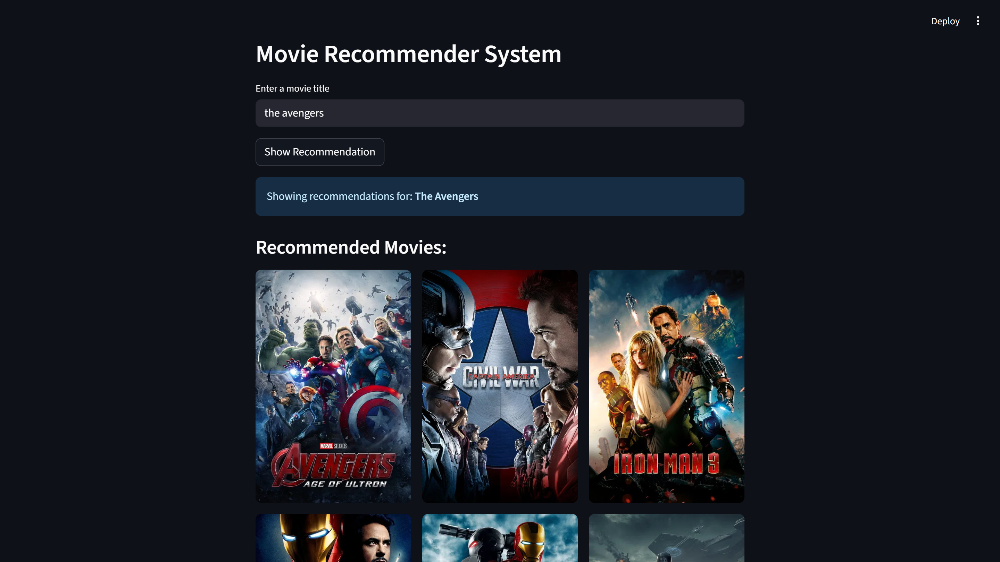

# 🎬 Movie Recommender System

Welcome to the Movie Recommender System! This project is a web application that helps you discover new movies based on your interests. It uses smart technology to suggest movies you'll love.

## ✨ Sneak Peek

Here's what the app looks like when it's running:



## 💡 How It Works

Our system is powered by a **hybrid recommendation model**, which is a fancy way of saying it combines two different methods to give you the best suggestions:

- **1. It understands movies:** It looks at movie details like **genres, keywords, cast, and director** to find other movies that are similar to your favorite one. For example, if you like a sci-fi movie with Tom Hanks, it will find other sci-fi movies or movies starring Tom Hanks.
- **2. It understands people:** It looks at what other people with similar tastes have watched and liked. If you and another person have similar movie ratings, it will recommend movies that they enjoyed but you haven't seen yet.

When you type a movie title, our system is smart enough to handle typos or different spellings (like "ironman" vs. "Iron Man"). It finds the closest match and gives you fast recommendations with a cool grid of movie posters.

## 📂 Data Sources

The datasets used to build and train this recommendation system are publicly available and can be found in the `data/` directory of this repository.

- **[TMDB 5000 Movie Dataset](https://www.kaggle.com/datasets/tmdb/tmdb-movie-metadata)**: This dataset provides detailed information about movies, including genres, keywords, cast, and crew. It's the primary source for the content-based filtering part of our model.
- **[The Movies Dataset](https://www.kaggle.com/datasets/rounakbanik/the-movies-dataset)**: This dataset contains movie ratings provided by users. We use it to train the collaborative filtering part of our model, which helps us understand user preferences.

## 🚀 Getting Started

Follow these simple steps to get this project up and running on your computer.

### Step 1: Get the Code

First, you need to get a copy of the project. Open your terminal or command prompt and run this command:

```sh
git clone https://github.com/lskeey/movie-recommendation-system.git
cd movie-recommendation-system
```

### Step 2: Install Required Libraries

Install all the necessary tools and libraries the project needs.

```sh
pip install -r requirements.txt
```

### Step 3: Get a TMDB API Key

Our app needs a key to get movie posters.

Go to [The Movie Database (TMDB) API](https://www.themoviedb.org/documentation/api) website and sign up for an API key.

Once you have the key, create a new file named `.env` in the main project folder.

Add your key to this file like this:

```sh
TMDB_API_KEY="your_api_key_here"
```

### Step 4: Train the Model

Run the `hybrid_filtering.ipynb` in the `notebooks/` directory to train the collaborative and content-based filtering models and generate the `recommender_models.pkl` file in the `models/` directory.

## ▶️ Running the App

Once everything is set up, you can start the application with a single command:

```sh
streamlit run app/streamlit_app.py
```

Your web browser will automatically open the application. Enjoy exploring movie recommendations!
